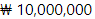

# Description
금액을 보여줄 때 사용자의 가독성을 높이기 위해 사용하는 React component 입니다. <br/>
세 자릿수마다 콤마(,)를 붙여줍니다.
화폐 단위와 단위의 위치를 지정해서 보여줄 수 있습니다.

## Examples

```jsx
import { Money } from "@beautifulstore/money";
render() {
  return (
    <Money amount={10000000} currency='₩' currencyPosition="left" />
  );
};
```


## Installation

```bash
npm install @beautifulstore/money
```

## Props
|Name|Default|Description|
|------|:---:|---|
|amount|null|보여주려는 금액|
|currency|'원'|화폐 단위 ( '원' or '₩' ) |
|currencyPosition|'right'|단위 표시 위치 ( 'left' or 'right' )|
